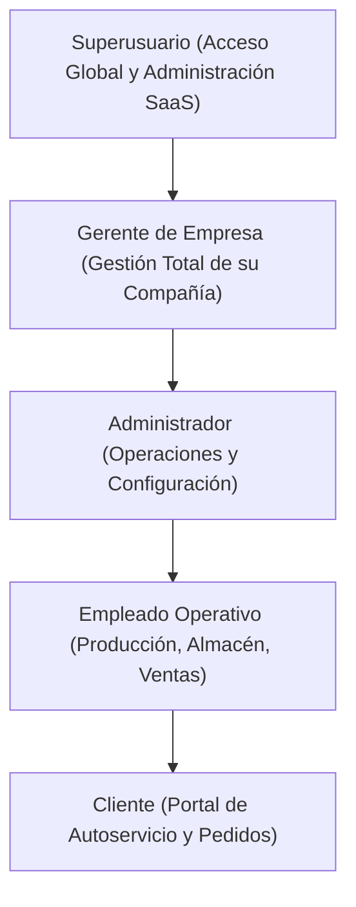

# 🐾 Concentrados El Gordito — Plataforma SaaS Multi-Empresa

**Sistema de Gestión Empresarial y Producción Agropecuaria Multi-Tenant**

Plataforma web integral estructurada bajo el patrón arquitectónico **100% MVC (Modelo - Vista - Controlador)** para la administración, producción, inventario, ventas y facturación de alimentos concentrados para animales (avícola, porcino, ganadero y mascotas), con soporte **Multi-Empresa aislado**, pasarela de pagos integrada (**Wompi SV**) y control de acceso jerárquico granular.

---

## 📋 Tabla de Contenidos

- [✨ Características Principales](#-características-principales)
- [🏢 Arquitectura Multi-Empresa (Multi-Tenant)](#-arquitectura-multi-empresa-multi-tenant)
- [🛡️ Jerarquía de Roles y Seguridad](#️-jerarquía-de-roles-y-seguridad)
- [🏛️ Arquitectura MVC y Reglas del Proyecto](#️-arquitectura-mvc-y-reglas-del-proyecto)
- [📁 Estructura del Proyecto y Recursos](#-estructura-del-proyecto-y-recursos)
- [🛠 Tecnologías Utilizadas](#-tecnologías-utilizadas)
- [🚀 Instalación y Puesta en Marcha](#-instalación-y-puesta-en-marcha)
- [🗄️ Diccionario y Base de Datos](#️-diccionario-y-base-de-datos)
- [🔑 Cuentas y Accesos Preconfigurados](#-cuentas-y-accesos-preconfigurados)
- [🔍 Auditoría y Reportes en PDF](#-auditoría-y-reportes-en-pdf)

---

## ✨ Características Principales

| Módulo | Capacidades y Funcionalidades |
| :--- | :--- |
| **🏢 Administración de Empresas** | Gestión completa de empresas suscritas, configuración de logo, teléfono, NIT, comisiones, generación de catálogo público por token seguro (`cat_key`) y asignación de dueños/gerentes. |
| **📊 Dashboard Gerencial** | KPIs en tiempo real (Ventas del mes, pedidos pendientes, stock crítico, producción mensual), gráficos estadísticos interactivos y trazabilidad de pedidos por empresa. |
| **📦 Pedidos de Clientes** | Registro y control de órdenes de compra, cálculo automático de materias primas por fórmula/receta, ficha modal detallada y actualización de estados en tiempo real. |
| **🛒 Catálogo y Pasarela Wompi** | Landing page moderna con carrito de compras y pasarela de pago en línea (**Wompi El Salvador**) para compras directas de concentrados con confirmación automática. |
| **🏭 Producción y Fórmulas** | Registro de lotes de producción vinculados a empleados responsables, control de mezclas y consumo proporcional de materia prima. |
| **📦 Inventario y Materia Prima** | Existencias en tiempo real, alertas de stock mínimo y crítico, histórico de compras y kardex por almacén de empresa. |
| **🚚 Pedidos a Proveedor y Facturas** | Solicitud y recepción de insumos a proveedores, registro de facturas de compra y costos unitarios. |
| **🏷️ Promociones y Precios** | Descuentos temporales con vigencia programada, cancelación automática por vencimiento y nivelación masiva de precios porcentual. |
| **🛡️ Roles y Permisos Granulares** | Asignación de permisos individuales sobre 17 submódulos con herencia de roles y control de acceso estricto. |
| **📑 Reportes Oficiales en PDF** | Generación de reportes profesionales en formato PDF (Inventario, mezclas, pedidos, proveedores, empleados) con **mPDF**. |
| **🕵️ Auditoría y Sesiones Activas** | Registro de inicio/cierre de sesión, cambios CRUD, control de sesiones únicas concurrentes y purga automática. |

---

## 🏢 Arquitectura Multi-Empresa (Multi-Tenant)

El sistema opera bajo un modelo **Multi-Tenant con aislamiento a nivel de base de datos** mediante la columna `idEmpresa`:

1. **Aislamiento Total de Datos**:
   - Cada empresa (Gerente, Administrador, Empleados) opera de forma 100% aislada. No se mezclan pedidos, inventarios, facturas, clientes ni reportes entre compañías.
2. **Generación Dinámica de Correos Corporativos**:
   - Al registrar un nuevo empleado o administrador en una empresa, el sistema genera automáticamente su usuario y correo utilizando el **dominio oficial de la empresa** (ej. `juan.perez@santaelena.com`, `maria.lopez@avicolasanjose.sv`, `carlos.gomez@gordito.com`).
3. **Rol Superusuario Global**:
   - El Superusuario (`amilcar199819@gmail.com`) dispone de visión global y control centralizado, visualizando la procedencia de cada registro mediante insignias de compañía.
4. **Catálogos Públicos Independientes**:
   - Cada empresa cuenta con un enlace público único generado con un token de acceso seguro (`landing.php?empresa=ID&cat_key=TOKEN`) para exhibir sus productos a sus clientes.

---

## 🛡️ Jerarquía de Roles y Seguridad



- **Control de Sesiones Únicas**: El sistema invalida sesiones previas si el mismo usuario inicia sesión desde otro dispositivo o navegador.
- **Cambio de Contraseña Temporal Obligatorio**: Los nuevos usuarios creados con claves temporales son redirigidos forzosamente a una vista de cambio de clave segura antes de acceder a las funciones del sistema.
- **Protección contra Inyecciones SQL**: Todas las consultas a base de datos utilizan sentencias preparadas (`prepared statements`) mediante `mysqli`.

---

## 🏛️ Arquitectura MVC y Reglas del Proyecto

Este repositorio cumple estrictamente con las directrices de calidad y diseño de software definidas en [`AGENTS.md`](file:///c:/xampp/htdocs/proyectoX/AGENTS.md) y [`GEMINI.md`](file:///c:/xampp/htdocs/proyectoX/GEMINI.md):

1. **Arquitectura 100% MVC**:
   - **Controladores (`controllers/`)**: Orquestan el flujo, limpian peticiones (`$_POST`, `$_GET`, JSON) e invocan a los modelos. Prohibido ejecutar SQL directo en controladores.
   - **Modelos (`models/`)**: Encapsulan la lógica de negocio y persistencia usando la clase `Conexion`. Retornan estructuras limpias (arrays, objetos, booleanos). Prohibido imprimir HTML.
   - **Vistas (`views/`)**: Responsables exclusivas de la presentación visual consumiendo los datos expuestos por el controlador. Prohibido instanciar conexiones a base de datos dentro de las vistas.
2. **Nomenclatura 100% en Español**:
   - Todos los métodos, funciones y clases siguen nomenclatura en español (`obtenerPorId()`, `guardar()`, `listarTodos()`, `actualizar()`, `eliminar()`).
3. **Métodos Cortos y con Pocos Parámetros**:
   - Métodos concisos de responsabilidad única (10-25 líneas), con máximo 2 a 3 parámetros agrupados en arreglos o entidades.
4. **Documentación Obligatoria en Base de Datos (SQL COMMENT)**:
   - Toda tabla y columna en la base de datos contiene obligatoriamente su descripción técnica mediante la cláusula `COMMENT '...'`.

---

## 📁 Estructura del Proyecto y Recursos

La estructura del proyecto ha sido saneada y centralizada:

```
proyectoX/
├── config/                      # Archivos de configuración (correo, integraciones)
│   └── correo.php               # Parámetros SMTP y API de correo
│
├── controllers/                 # Controladores del sistema (MVC)
│   ├── controllerDashboard.php  # Dashboard y analíticas
│   ├── controllerPedidos.php    # Gestión de pedidos de clientes
│   ├── controllerEmpleado.php   # CRUD de empleados y generación de credenciales
│   ├── controllerConfiguracionNegocio.php # Administración SaaS de empresas
│   ├── controllerProduccion.php # Lotes de producción
│   ├── controllerInventario.php # Control de inventarios
│   ├── controllerPromociones.php # Campañas de descuento y precios
│   ├── sesiones.php             # Middleware guardián de autenticación y permisos
│   │
│   ├── vendor/                  # RECURSOS FRONTEND CENTRALIZADOS
│   │   ├── bootstrap/           # Framework Bootstrap 4
│   │   ├── fontawesome-free/    # Iconografía Font Awesome 6
│   │   ├── datatables/          # Plugins y estilos DataTables
│   │   ├── jquery/              # jQuery Core
│   │   ├── jquery-easing/       # Animaciones de transición
│   │   ├── sb-admin.css         # Estilos del tema SB Admin
│   │   ├── sweetalert2.all.min.js # Alertas interactivas
│   │   └── autoload.php         # Autoload de dependencias backend
│   └── js/                      # Scripts JS propios del sistema
│
├── models/                      # Capa de datos y lógica de negocio (MVC)
│   ├── EmpresaModel.php         # Gestión multi-tenant y dominios
│   ├── ModelPedido.php          # Pedidos de clientes
│   ├── ModelPedidoProveedorMVC.php # Pedidos de compra a proveedores
│   ├── ModelFactura.php         # Facturas de materias primas
│   ├── ModelProduccion.php      # Lotes de producción
│   ├── ModelInventario.php      # Existencias y stock
│   ├── PromocionModel.php       # Reglas de precios y descuentos
│   ├── PermisoModel.php         # Matriz de permisos y submódulos
│   ├── AuditoriaModel.php       # Logs y sesiones activas
│   └── ServicioCorreo.php       # Envío de notificaciones y recuperación
│
├── views/                       # Vistas de presentación (HTML5 / PHP)
│   ├── configuracion.php        # Layout base, navbar y menú lateral dinámico
│   ├── vistaDashboard.php       # Panel de control principal
│   ├── vistaPedidos.php         # Listado y detalle de pedidos
│   ├── vistaConfiguracionNegocio.php # Panel y modal de empresas
│   ├── vistaEmpleado.php        # Administración de personal
│   ├── vistaPromociones.php     # Gestión de precios y promociones
│   ├── landing.php              # Catálogo público y tienda en línea
│   └── login.php                # Inicio de sesión con fondo dinámico
│
├── db/                          # Scripts SQL y migraciones
│   ├── conexion.php             # Conexión Singleton a MySQL
│   ├── multitenant_empresas.sql # Estructura multi-tenant y tablas de empresas
│   ├── diccionario_datos_completo.sql # Diccionario con COMMENT en todas las tablas
│   └── permisos.sql             # Matriz de roles y submódulos
│
├── vendor/                      # DEPENDENCIAS COMPOSER (Backend / mPDF)
│   └── autoload.php
│
├── wompi/                       # Pasarela de pagos Wompi El Salvador
│   ├── create-checkout-session.php
│   └── success.php
│
├── AGENTS.md                    # Reglas estrictas de arquitectura y desarrollo
├── GEMINI.md                    # Reglas de desarrollo para el asistente
└── README.md                    # Documentación técnica general
```

> [!NOTE]
> **Saneamiento de Recursos**: La carpeta huérfana `views/vendor/` fue eliminada y todas las vistas han sido redirigidas para consumir los recursos estáticos de forma unificada desde `controllers/vendor/` y las librerías PHP desde `vendor/`.

---

## 🛠 Tecnologías Utilizadas

- **Lenguaje Principal**: PHP 7.4 / 8.x
- **Motor de Base de Datos**: MySQL 5.7+ / MariaDB 10.4+
- **Estilos y Maquetación**: CSS3, Bootstrap 4, SB-Admin, Paleta HSL y Glassmorphism
- **JavaScript**: Vanilla JS, jQuery 3.6, SweetAlert2, DataTables, Chart.js
- **Generación de Documentos**: mPDF 8.x
- **Pasarela de Pago**: Wompi API REST (El Salvador)
- **Servicio de Correo**: SMTP / Resend API / PHPMailer

---

## 🚀 Instalación y Puesta en Marcha

### 1. Clonar el repositorio en tu servidor local (XAMPP / Apache)

```bash
cd c:/xampp/htdocs/
git clone https://github.com/Amilcar1998/proyectoX.git
cd proyectoX
```

### 2. Importar la Base de Datos

En tu cliente MySQL o phpMyAdmin:

```sql
CREATE DATABASE IF NOT EXISTS elgordito_bd CHARACTER SET utf8mb4 COLLATE utf8mb4_unicode_ci;
USE elgordito_bd;

-- Importar estructura y datos iniciales
SOURCE db/multitenant_empresas.sql;
SOURCE db/permisos.sql;
SOURCE db/diccionario_datos_completo.sql;
```

### 3. Verificar Parámetros de Conexión

Revisa el archivo [`db/parametros.php`](file:///c:/xampp/htdocs/proyectoX/db/parametros.php) o [`db/conexion.php`](file:///c:/xampp/htdocs/proyectoX/db/conexion.php):

```php
define("SERVER", "localhost");
define("USER", "root");
define("PASSWORD", "");
define("BASE", "elgordito_bd");
define("CHAR", "utf8mb4");
```

### 4. Abrir en el Navegador

- **Portal Principal / Login**: `http://localhost/proyectoX/controllers/controlUser.php` (o `http://localhost/proyectoX/views/login.php`)
- **Catálogo Público de Ventas**: `http://localhost/proyectoX/controllers/controllerLanding.php`
- **Dashboard**: `http://localhost/proyectoX/controllers/controllerDashboard.php`

---

## 🗄️ Diccionario y Base de Datos

El sistema consta de **31 tablas** documentadas con cláusulas `COMMENT` en cada campo:

| Grupo | Tablas |
| :--- | :--- |
| **Empresas y Multi-Tenant** | `empresas`, `empresa_configuracion`, `plan_pago`, `usuario_plan_pago` |
| **Seguridad y Usuarios** | `usuarios`, `rol`, `permisos_usuario_submodulo`, `recuperacion_pass`, `sesiones_activas`, `auditoria` |
| **Operaciones y Personal** | `empleado`, `puesto`, `cliente`, `proveedor` |
| **Catálogo y Producción** | `receta`, `materiaprima`, `detallereceta`, `produccion`, `inventario` |
| **Ventas y Facturación** | `pedido`, `detallepedido`, `estadopedido`, `factura`, `detallecompra`, `salidas`, `historico_precios_promociones` |

---

## 🔑 Cuentas y Accesos Preconfigurados

| Rol / Empresa | Usuario / Correo | Contraseña | Alcance |
| :--- | :--- | :--- | :--- |
| **Superusuario** | `amilcar199819@gmail.com` | *(Clave registrada)* | Acceso total global, panel SaaS multi-empresa. |
| **Gerente (Empresa 1)** | `gerente@gordito.com` | `admin123` *(o clave asignada)* | Gestión completa de Concentrados El Gordito. |
| **Gerente (Empresa 2)** | `carlos.mendoza@santaelena.com` | `admin123` | Gestión de Agropecuaria Santa Elena. |
| **Gerente (Empresa 3)** | `elena.flores@avicolasanjose.sv` | `admin123` | Gestión de Avícola San José. |

---

## 🔍 Auditoría y Reportes en PDF

El sistema ofrece monitoreo continuo accesible desde el panel de reportes:
- **Auditoría de Actividades**: `controllers/reporteAuditoria.php`
- **Monitoreo de Sesiones Activas**: `controllers/reporteSesionesActivas.php`
- **Reporte de Inventario General / Escaso**: `controllers/reporteInventarioGeneral.php`, `controllers/reporteInventarioEscaso.php`
- **Reporte de Mezclas de Producción**: `controllers/reporteMezclas.php`
- **Reporte de Pedidos y Proveedores**: `controllers/reportePedidos.php`, `controllers/reportePedidoProveedor.php`

---

© **2026 Concentrados El Gordito** — Todos los derechos reservados.
